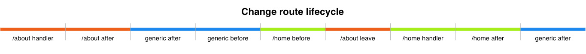

# Coffeekraken s-router-component 

<p>
	<!-- <a href="https://travis-ci.org/coffeekraken/s-router-component">
		
	</a> -->
	<a href="https://www.npmjs.com/package/coffeekraken-s-router-component">
		
	</a>
	<a href="https://github.com/coffeekraken/s-router-component/blob/master/LICENSE.txt">
		
	</a>
	<!-- <a href="https://github.com/coffeekraken/s-router-component">
		
	</a>
	<a href="https://github.com/coffeekraken/s-router-component">
		
	</a>
	<a href="https://github.com/coffeekraken/s-router-component">
		
	</a> -->
	<a href="https://twitter.com/{twitter-username}">
		
	</a>
	<a href="http://coffeekraken.io">
		
	</a>
</p>

<p class="lead">A simple but powerful router webcomponent with full route lifecycle (before, handler, after, leave)</p>

## Table of content

1. **[Demo](http://components.coffeekraken.io/app/s-router-component)**
2. [Install](#readme-install)
3. [Get Started](#readme-get-started)
4. [Javascript API](doc/js)
5. [Handler function](#readme-handler)
6. [Url parameters](#readme-params)
7. [Source parameter](#readme-source)
8. [Hooks](#readme-hooks)
9. [Lifecycle](#readme-lifecycle)
10. [Classes](#readme-classes)
11. [Sugar Web Components Documentation](https://github.com/coffeekraken/sugar/blob/master/doc/webcomponent.md)
12. [Browsers support](#readme-browsers-support)
13. [Code linting](#readme-code-linting)
14. [Contribute](#readme-contribute)
15. [Who are Coffeekraken?](#readme-who-are-coffeekraken)
16. [Licence](#readme-license)

<a name="readme-install"></a>

## Install

```
npm install coffeekraken-s-router-component --save
```

<a name="readme-get-started"></a>

## Get Started

First, import the component into your javascript file like so:

```js
import SRouterComponent from "coffeekraken-s-router-component"
```

Then, register some routes like so:

```js
SRouterComponent.on("/", async (params, source) => {
  // do something here...
})
  .on("/user/:id", async (params, source) => {
    // do something here...
  })
  .listen() // start listening for routes changes
```

Then simply use it inside your html like so:

```html
<a href="/user/2" is="s-router">Go to profile page</a>
```

<a id="readme-handler"></a>

## Handler functions

The handler functions are the main concept of this router implementation. Each route have a "path" that is bound to an "handler function".

Here's an example:

```js
SRouterComponent.on("/path", (params, source) => {
  // I'm the handler function of the /path route
}).listen()
```

### Not found handler

You can register a not found handler easily by doing this:

```js
SRouterComponent
  // your routes...
  .notFound((params, source) => {
    // do something on 404
  })
  .listen()
```

<a id="readme-params"></a>

## Url parameters

The router allows you to add some parameters in your routes. These parameters are formated like so : `:paramName`.
Here's an example:

```html
<a href="/user/10" is="s-router">Go to profile page</a>
```

Consider we have clicked on this link:

```js
SRouterComponent.on("/user/:id", (params, source) => {
  console.log(params.id) // will output `10`
}).listen()
```

> The urls support also the `*` wildcard that you can use like so : `/my/*/route`

<a id="readme-source"></a>

## Source parameter

You have maybe see that the route handler function take two parameters. The `params` that we've seen before and the `source`.
This `source` param can be of two different types:

1. When the route is triggered from a click on a `s-router` link: Will be the `HTMLAnchorElement` link in question
2. When the route is trigerred from any other way: Will be `window.history`

<a id="readme-hooks"></a>

## Hooks

On each routes, you can have some hooks configured. Here's the list of available hooks:

1. `before`: Run before the actual route handler function. Need to return a promise. Take as parameters the `params` and the `source`
2. `after`: Run after the actual route handler function. Take as parameters the `params` and the `source`
3. `leave`: Run when the route is bein leaved. Can return a promise. Take as parameters the `params` and the `source`

Here's an example of use:

```js
SRouterComponent.on(
  "/admin",
  (params, source) => {
    // do something to display the admin here...
  },
  {
    before: (params, source) => {
      if (!isUserLogged()) return false // block the user here is he's not logged in
    },
    after: (params, source) => {
      // do something after the admin route has bein displayed
    },
    leave: (params, source) => {
      // clear some things, etc...
    }
  }
).listen()
```

> Each hooks can be marked as `async` or return simply a `Promise`. Be careful, use this if you know what you are doing... Introducing asyncronous tasks inside a router can lead to tricky issues to debug.

<a id="readme-lifecycle"></a>

## Change route lifecycle

Here's a schema of a route change in order to understand the lifecycle:



You can see that the `/home before` is run **before** the `/about leave`. This mean that if your `/home before` hook return `false`, the previous route which is `/about` won't have his `leave` hook called

<a id="readme-classes"></a>

## Classes

To make things easy to work with, the router add some classes on each `s-router` links during his lifecycle. Here's the list of classes:

1. `active`: Added on the links that match exactly the current route
2. `active-within`: Added on the links that are "parent" of the current route. Ex: `/user` is parent of `/user/12`

<a id="readme-browsers-support"></a>

## Browsers support

| </br>IE / Edge | </br>Firefox | </br>Chrome | </br>Safari |
| ------------------------------------------------------------------------------------------------------------------------------------------------------------------ | ----------------------------------------------------------------------------------------------------------------------------------------------------------------- | -------------------------------------------------------------------------------------------------------------------------------------------------------------- | -------------------------------------------------------------------------------------------------------------------------------------------------------------- |
| IE11+                                                                                                                                                              | last 2 versions                                                                                                                                                   | last 2 versions                                                                                                                                                | last 2 versions                                                                                                                                                |

> As browsers are automatically updated, we will keep as reference the last two versions of each but this component can work on older ones as well.

> The webcomponent API (custom elements, shadowDOM, etc...) is not supported in some older browsers like IE10, etc... In order to make them work, you will need to integrate the [corresponding polyfill](https://www.webcomponents.org/polyfills).

<a id="readme-code-linting"></a>

## Code linting

This package uses some code linting rules. Here's the list:

1. [StandardJS](https://standardjs.com/) for javascript files
2. [Stylelint](https://github.com/stylelint/stylelint) with [stylelint-config-standard](https://github.com/stylelint/stylelint-config-standard) for `scss` files

> Your commits will not been accepted if the code style is not respected!

<a id="readme-contribute"></a>

## Contribute

This is an open source project and will ever be! You are more that welcomed to contribute to his development and make it more awesome every day.
To do so, you have several possibilities:

1. [Share the love ❤️](https://github.com/Coffeekraken/coffeekraken/blob/master/contribute.md#contribute-share-the-love)
2. [Declare issues](https://github.com/Coffeekraken/coffeekraken/blob/master/contribute.md#contribute-declare-issues)
3. [Fix issues](https://github.com/Coffeekraken/coffeekraken/blob/master/contribute.md#contribute-fix-issues)
4. [Add features](https://github.com/Coffeekraken/coffeekraken/blob/master/contribute.md#contribute-add-features)
5. [Build web component](https://github.com/Coffeekraken/coffeekraken/blob/master/contribute.md#contribute-build-web-component)

<a id="readme-who-are-coffeekraken"></a>

## Who are Coffeekraken

We try to be **some cool guys** that build **some cool tools** to make our (and yours hopefully) **every day life better**.

#### [More on who we are](https://github.com/Coffeekraken/coffeekraken/blob/master/who-are-we.md)

<a id="readme-license"></a>

## License

The code is available under the [MIT license](LICENSE.txt). This mean that you can use, modify, or do whatever you want with it. This mean also that it is shipped to you for free, so don't be a hater and if you find some issues, etc... feel free to [contribute](https://github.com/Coffeekraken/coffeekraken/blob/master/contribute.md) instead of sharing your frustrations on social networks like an asshole...
